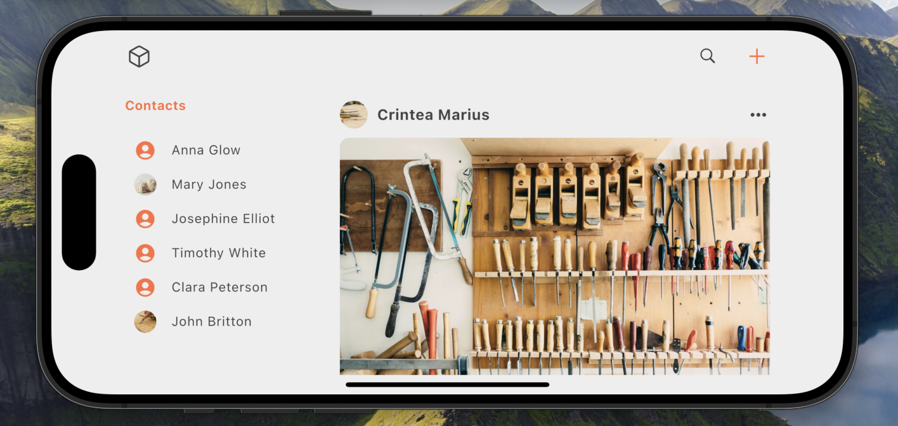

# Social media app concept

This is a social media application concept developed using the Flutter framework for Android, iOS
and Web platforms.
The idea of this application is to bring together all people passionate about handmade things in one
place.
The ability to log in and register users using the Firebase platform has been integrated.
It has the feature of adapting to any screen size: mobile, tablet, desktop.
The application contains the following pages: home page, profile page, edit profile page, login and
register page.
It comes with a simple and elegant design.

## Screen size adaptation

## Main components and features

- User authentication
    - Login user
    - Register user
    - User logout

- Cross platform app
    - Android
    - iOS
    - Web

- Screen size adaptation
    - Desktop screen size
    - Tablet screen size
    - Mobile screen size

- App pages
    - Home page
    - Profile page
    - Edit profile page
    - Login page
    - Register page

## Libraries

- firebase_core
- firebase_auth
- flutter_bloc
- cloud_firestore

# App screenshots

## Mobile version

  
  
  
  
  
  

### Landscape mobile = tablet mode

  

## Web version

  
  
  
  

  
  

# References

## Images

### Posts

1. https://unsplash.com/photos/top-view-of-assorted-shape-and-sized-wooden-kitchen-utensils-mSupi19KDC4?utm_content=creditShareLink&utm_medium=referral&utm_source=unsplash
2. https://unsplash.com/photos/throw-pillow-on-chair-beside-plant-on-stand-3ugRoVpotNk?utm_content=creditShareLink&utm_medium=referral&utm_source=unsplas
3. https://unsplash.com/photos/assorted-handheld-tools-in-tool-rack-t5YUoHW6zRo?utm_content=creditShareLink&utm_medium=referral&utm_source=unsplash

### Profile

1. https://unsplash.com/photos/a-ball-of-yarn-and-a-knitting-needle-on-a-white-surface-6DFFPF6uqeY?utm_content=creditShareLink&utm_medium=referral&utm_source=unsplash
2. https://unsplash.com/photos/green-and-purple-yarn-ball-0TvE4CQ33_I?utm_content=creditShareLink&utm_medium=referral&utm_source=unsplash
3. https://unsplash.com/photos/hand-tools-on-top-of-table-v8vz-Roj8zo?utm_content=creditShareLink&utm_medium=referral&utm_source=unsplash

## Icons

### Profile

1. https://www.flaticon.com/free-icons/facebook title="facebook icons" Facebook icons created by
   Freepik - Flaticon
2. https://www.flaticon.com/free-icons/instagram-logo title="instagram logo icons" Instagram logo
   icons created by Freepik - Flaticon

